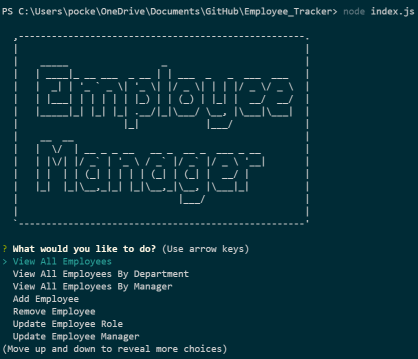

# Employee Manager
***

## Table of Contents
* [Description](#description)
* [Deployment](#deployment)
* [Usage](#usage)
* [Contact](#contact)
* [Repository](#repository)
### Description
This is a command-line application that uses a content management system (CMS) interface which allows non-developers to easily view and interact with so they can manage a company's employee database.
 
### Deployment
This application is deployed by the user at the command line using 'node index.js' after they have downloaded the files from the repository.
 
### Usage
Once the user downloads the repository, they are to open the terminal and type 'node index.js'.  They are then presented with an Employee Manager menu with various prompts the user can select from using the arrow keys.  The user may then view all the employees, view all employees by department or management, add or remove employees, and updated employee roles and managers.  The users can save the inputed data and it will be moved to the database.